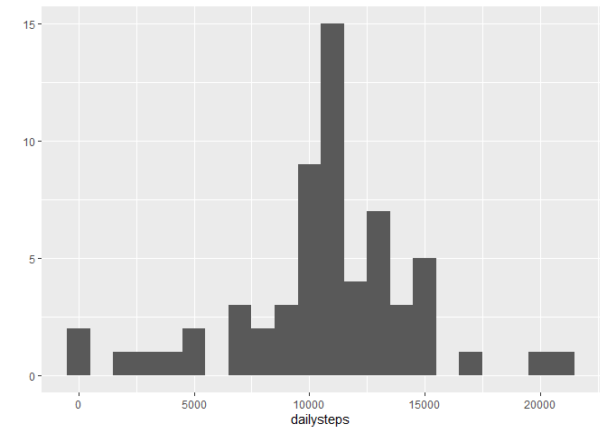
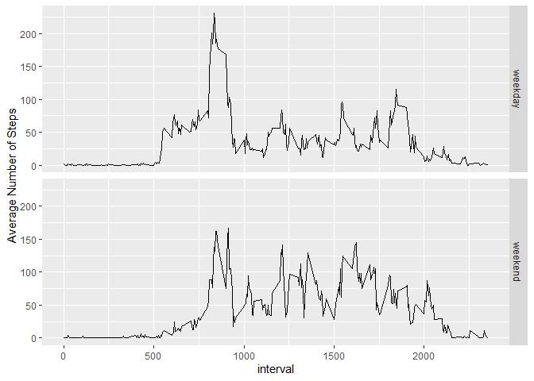

## Introduction
01/08/2021

This assignment makes use of data from a personal activity monitoring device. This device collects data at 5 minute intervals through out the day. The data consists of two months of data from an anonymous individual collected during the months of October and November, 2012 and include the number of steps taken in 5 minute intervals each day.

The data for this assignment can be downloaded from the following link:

Dataset: [Activity monitoring data](https://d396qusza40orc.cloudfront.net/repdata%2Fdata%2Factivity.zip)

The variables included in this dataset are:

**steps:** Number of steps taking in a 5-minute interval (missing values are coded as NA)  
**date:** The date on which the measurement was taken in YYYY-MM-DD format  
**interval:** Identifier for the 5-minute interval in which measurement was taken  

The dataset is stored in a comma-separated-value (CSV) file and there are a total of 17,568 observations in this dataset.


# Packages

```r
library(tidyverse)
```

## Loading and preprocessing the data

**1. Unzip and load the data:**

```r
unzip(zipfile = "activity.zip")
data <- read.csv("activity.csv")
```

**2. Convert date variable into date format:**

```r
data$date <- as.Date(data$date, "%Y-%m-%d")
```

## What is mean total number of steps taken per day?

**1. Calculate the total number of steps taken per day:**

```r
totalsteps <- data %>% group_by(date) %>% 
  summarise(dailysteps = sum(steps))
```

**2. Histogram of the total number of steps taken each day:**

```r
qplot(dailysteps, data = totalsteps, binwidth = 1000)
```

<!-- -->

**3. The mean and median of the total number of steps taken per day**

```r
## Mean
mean(totalsteps$dailysteps, na.rm = TRUE)
```

```
## [1] 10766.19
```


```r
## Median
median(totalsteps$dailysteps, na.rm = TRUE)
```

```
## [1] 10765
```

## What is the average daily activity pattern?

**1. Make a time series plot of the 5-minute interval (x-axis) and the average number of steps taken, averaged across all days (y-axis)**


```r
avsteps <- data %>% group_by(interval) %>% 
  summarise(average = mean(steps, na.rm = TRUE))
with(avsteps, plot(interval, average, type="l"))
```

<!-- -->

**2. Which 5-minute interval, on average across all the days in the dataset, contains the maximum number of steps?**


```r
avsteps[which.max(avsteps$average),]
```

```
## # A tibble: 1 x 2
##   interval average
##      <int>   <dbl>
## 1      835    206.
```

## Imputing missing values

**1. Calculate and report the total number of missing values in the dataset**

```r
sum(is.na(data$steps))
```

```
## [1] 2304
```
**2. Devise a strategy for filling in all of the missing values in the dataset. The strategy does not need to be sophisticated. For example, you could use the mean/median for that day, or the mean for that 5-minute interval, etc.**

I have decided to impute the missing values with the mean for that 5-minute interval across days.

**3. Create a new dataset that is equal to the original dataset but with the missing data filled in.**


```r
data2 <- merge(data, avsteps)
data2$steps <- ifelse(is.na(data2$steps), yes = data2$average, no = data2$steps)
```

**4. Make a histogram of the total number of steps taken each day and Calculate and report the mean and median total number of steps taken per day. Do these values differ from the estimates from the first part of the assignment? What is the impact of imputing missing data on the estimates of the total daily number of steps?**


```r
totalsteps2 <- data2 %>% group_by(date) %>% 
  summarise(dailysteps = sum(steps))
qplot(dailysteps, data = totalsteps2, binwidth = 1000)
```

<!-- -->


```r
## Mean after imputation
mean(totalsteps2$dailysteps, na.rm = TRUE)
```

```
## [1] 10766.19
```


```r
## Median after imputation
median(totalsteps2$dailysteps, na.rm = TRUE)
```

```
## [1] 10766.19
```

## Are there differences in activity patterns between weekdays and weekends?

**1. Create a new factor variable in the dataset with two levels – “weekday” and “weekend” indicating whether a given date is a weekday or weekend day.**


```r
data2$wday <- ifelse(weekdays(data2$date) %in% c("Saturday","Sunday"), "weekend", "weekday")
```

**2. Make a panel plot containing a time series plot of the 5-minute interval (x-axis) and the average number of steps taken, averaged across all weekday days or weekend days (y-axis).**


```r
avsteps2 <- data2 %>% group_by(wday,interval) %>% 
  summarise(average = mean(steps))
```

```
## `summarise()` has grouped output by 'wday'. You can override using the `.groups` argument.
```

```r
ggplot(avsteps2, mapping = aes(interval,average)) +
  facet_grid(wday ~ .) + geom_line() +
  labs(y = "Average Number of Steps")
```

<!-- -->

**NOTE: Figures are placed in "./PA1_template_files/figure-html/" file.**
